  

## 🚀 About Me

- 💼 Former Software Developer at **Continental Automotive** (Oct 2022 - Jul 2024)
- 🎮 Passionate about **game engine development** and **developer tooling**
- 🛠️ Building tools that improve workflows and solve real problems
- 🌱 Currently working on **Eridion** - a 2D city builder inspired by Anno 1800
- 🇷🇴 Based in Romania

## 🎯 Currently Learning

- Advanced C++ patterns and performance optimization
- Modern game engine architecture
- Real-time system design and optimization

## 📊 Quick Stats

  
  

## 💻 Featured Projects

### 🛠️ Developer Tools

⭐ *In Active Development* - Electron desktop app for automatic application usage tracking
*Steam-inspired UI, real-time tracking, session analytics*
`Electron` `JavaScript` `HTML` `CSS` `SQLite`

### 🤖 Automation & Bots

Telegram bots for crypto market analysis
*AI summaries, price alerts, portfolio tracking, open-source*
`Python` `Telegram API` `SQLite` `CI/CD` `Raspberry Pi`

### 🎮 Game Development

⭐ *In Active Development* - 2D city-building game with procedural map generation inspired by Anno 1800
`Unity` `C#` `Perlin Noise` `Game Simulation`

2D farming RPG inspired by Stardew Valley, set in Romania
*Complete game systems + all custom pixel art created in Aseprite*
`Unity` `C#` `Aseprite`

Custom 2D game engine built from scratch in C++
*Features: Component system, physics engine, SDL2 rendering, ImGui editor*
`C++17` `SDL2` `ImGui`

## 🛠️ Tech Stack

**Languages:**  

**Frameworks & Tools:**  

**DevOps & Systems:**  

**Databases:**  

## 💼 Professional Experience

**Software Developer** @ Continental Automotive *(2021 - 2025)*
- Developed backend tools for ADAS radar sensor simulation (C++/Python)
- Built multi-component distributed systems with WebSockets
- Implemented CI/CD pipelines with Jenkins
- Improved system stability across Linux environments

## 🎨 When I'm Not Coding

- Creating pixel art in Aseprite for game projects
- Exploring game design and city-building mechanics
- Tinkering with Raspberry Pi automation projects

## 📊 Detailed Stats

  

  

  

## 📫 Let's Connect

  

---

💡 *"From game engines to developer tools - building what I'm passionate about, one commit at a time."*
